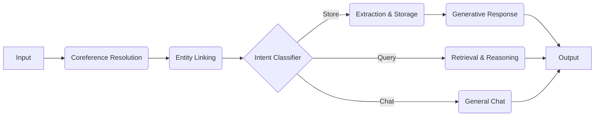

# Synapse: The Rational Memory Agent 🧠

Synapse is a "Second Brain" AI agent designed to maintain a persistent, evolving knowledge graph of your life, relationships, and interests. Unlike standard chatbots, it doesn't just "chat"—it actively structures information into a traversable network, allowing for "rational" recall and visualization.

---

## 🏗️ Architecture

The system follows a classic **Client-Server** architecture with a specialized **Agentic Pipeline** in the backend.

### 1. Frontend (The Neural Console)
- **Framework**: [Next.js](https://nextjs.org/) (React)
- **Role**: Serves as the interface for Chat, Graph Visualization, and Profile Management.
- **Key Components**:
    - **Neural Mind Map**: A real-time 2D force-directed graph (using `react-force-graph-2d`) that visualizes your brain's connections.
    - **Chat Interface**: A glassmorphic chat UI for natural language interaction.
    - **Profile View**: A dynamic sidebar that generates summaries of any node (person, place, etc.) on click.

### 2. Backend (The Rational Core)
- **Framework**: [FastAPI](https://fastapi.tiangolo.com/) (Python)
- **Role**: Handles API requests, manages the WebSocket/REST endpoints, and runs the AI pipeline.
- **Memory Store**:
    - **Engine**: [NetworkX](https://networkx.org/)
    - **Storage**: JSON-based persistent graph (`memory_graph.json`).
    - **Data Structure**: MultiDiGraph (Weighted Directed Multi-Graph) allowing complex relationships like Attributes, Edges, and Metadata (timestamps).

### 3. The Agent Pipeline (LangGraph)
The core intelligence is powered by [LangGraph](https://langchain-ai.github.io/langgraph/), orchestrating a multi-step workflow for every user message:



---

## 🛠️ Technology Stack

### Backend Libraries
- **`langgraph` & `langchain`**: For building the stateful agent workflow.
- **`fastapi` & `uvicorn`**: High-performance async web server.
- **`networkx`**: Mathematical graph theory library for managing the memory structure.
- **`pydantic`**: Data validation and strict schema enforcement for LLM outputs.
- **`openai` / `google-generativeai`**: LLM providers (GPT-4o or Gemini).

### Frontend Libraries
- **`next`**: React framework.
- **`react-force-graph-2d`**: Physics-based graph rendering.
- **`axios`**: API communication.
- **`vanilla-css`**: Custom glassmorphism styling (no Tailwind, pure CSS for control).

---

## 🎨 Prompt Engineering Strategy

The "Intelligence" of Synapse comes from a chain of highly specialized prompts, rather than one giant prompt.

### 1. Coreference Resolution
*Before* understanding the user, the agent rewrites the input to replace pronouns with real names based on context.
> "He is my friend" + [History: talking about Alex] -> **"Alex is Miccel's friend"**

### 2. Entity Linking & Identity
The agent dynamically identifies the **Primary User**. It doesn't hardcode "You"; it scans the graph to find *your* specific node (e.g., "Miccel") and attributes all 1st-person statements to that node.

### 3. Structural Extraction (The "Memory" Prompt)
We use a **Tiered Attribute Schema** to enforce clean data:
- **Nodes**: created for People, Organizations, and *Notable* Concepts (Hobbies, Locations).
- **Attributes**: created for adjectives or status updates.
- **Lists**: Handles multi-value attributes (e.g., `occupation: [student, skater]`) robustly.

### 4. Proactive Profiling
When you introduce a new person, the agent is prompted to be **Socially Proactive**:
> "If a NEW PERSON is met, ask about their role/relationship AND ask how you feel about them."

---

## 🚀 Flow of Use

1.  **Launch**: Run `./run_app.sh` to start both servers.
2.  **Onboarding**:
    - If your memory is empty, Synapse greets you and asks you to create your profile.
    - If you are returning, it welcomes you back.
3.  **Teaching**:
    - Say *"I met Gav today."* -> Agent stores the link `(Miccel) -[met]-> (Gav)`.
    - It proactively asks *"Who is Gav to you?"*
4.  **Visualizing**:
    - The graph at the bottom updates in real-time.
    - **Filter Console**: Type `Gav` to isolate his network. `Miccel and Gav` to see paths between you.
5.  **Recalling**:
    - Click any node to see a **Generated Profile Summary** on the left.
    - Ask *"Who works at Korea University?"* -> Agent traverses the graph to answer.

---

## 📂 Project Structure

```bash
.
├── backend/
│   ├── app/
│   │   ├── agent.py          # The Brain (LangGraph pipeline)
│   │   ├── memory.py         # The Hippocampus (NetworkX CRUD wrappers)
│   │   └── server.py         # The Nervous System (FastAPI routes)
│   ├── memory_graph.json     # The Long-term Memory (Storage)
│   └── requirements.txt      # Python dependencies
├── frontend/
│   ├── components/
│   │   └── GraphView.js      # The Eye (Force Graph Visualizer)
│   └── pages/
│   │   └── index.js          # The Interface (Main React UI)
└── run_app.sh                # Ignition Script
```
